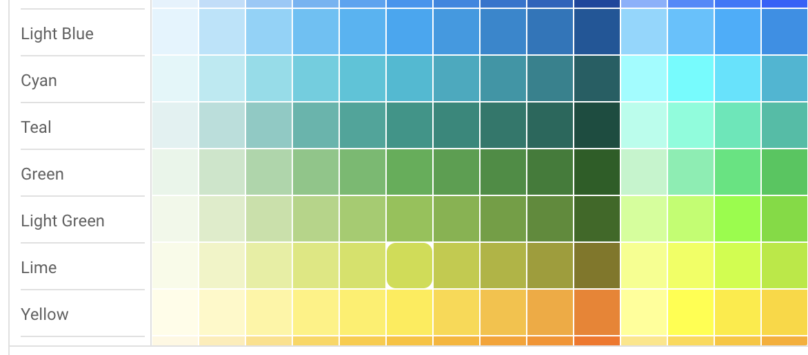
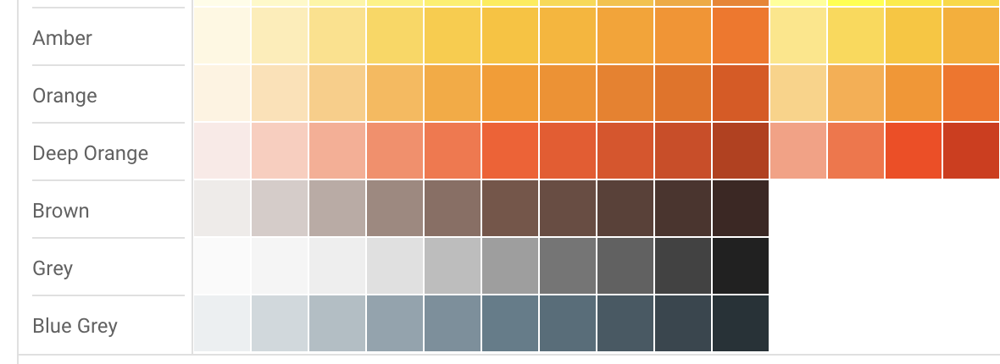

# Gomail Acorn Template

+ [Librerías](#librerías)
+ [Instalación](#instalación)
+ [Importación](#importación)
+ [Ejemplo](#ejemplo)
+ [Métodos](#métodos)
+ [Componentes](#componentes)
+ [Types](#types)
+ [Utilidades](#utilidades)

#### Librerías
Proyecto original:
- [Acorn Email Framework](http://docs.thememountain.com/acorn/)

#### Instalación
```
go get -u github.com/arskang/gomail-acorn-template
```

#### Importación
```go
import acornmail "github.com/arskang/gomail-acorn-template"
```

#### Ejemplo
```go
// En proceso...
```

#### Métodos

- *GetHTMLString*: Obtener un html con parámetros dinámicos
```go
html, err := acornmail.GetHTMLString("<div>{{.Title}}</div>", map[string]interface{}{
    "Title": "Hola mundo",
})
if err != nil {
    panic(err)
}
fmt.Println(html)
```

- *NewAcornEmailComponents*: Obtener el tipo **acornEmail** para poder construir un template
```go
acorn := acornmail.NewAcornEmailComponents()
```

##### Componentes

- **GetBoilerPlate**
```go
boilertemplate := acorn.GetBoilerPlate(
    "Header",
    "Body",
    "Footer",
    // componentes...
)
fmt.Println(boilertemplate)
```

- **Row**
```go
import "github.com/arskang/gomail-acorn-template/acornstyles"

func main() {
    wColumns := acornstyles.GetWidthColumns()
    row := acorn.NewRow([]*acorntypes.ColParams{
        {
            Content: "1/4 de columna",
            Styles: &acorntypes.Styles{
                WidthColumn: wColumns.Quarter,
            },
        },
        {
            Content: "1/2 de columna",
            Styles: &acorntypes.Styles{
                WidthColumn: wColumns.Medium,
            },
        },
        {
            Content: "1/4 de columna",
            Styles: &acorntypes.Styles{
                WidthColumn: wColumns.Quarter,
            },
        },
    })
    fmt.Println(row)
}
```

- **Alerts**
```go
content := "Aceptar"
hexColor := "#008f38"
outlined := nil // *bool
alert := acorn.NewAlert(content, hexColor, outlined)
fmt.Println(alert)
```

- **Buttons**
```go
button := acorn.NewButton(&acorntypes.ButtonParams {
    Text: "Aceptar",
    Link: "https://google.com",
    HexColor: "#008f38",
    // Align,
}, nil)
fmt.Println(button)
```

#### Types
```go
import "github.com/arskang/gomail-acorn-template/acorntypes"
```

- *Col*
```go
w := "1/4"
colParams := acorntypes.ColParams {
    Content: "Content", // string
    Width: &w, // *string
}
```

- *Button*
```go
buttonParams := acorntypes.ButtonParams {
    Text: "Aceptar",
    Link: "https://google.com",
    HexColor: "#008f38",
    // Align,
}
```

#### Utilidades

- *Ancho de columnas*

```go
widthColumn := acornstyles.GetWidthColumns()
fmt.Println(widthColumn.Full) // %100
fmt.Println(widthColumn.Quarter) // 1/4
fmt.Println(widthColumn.Medium) // 1/2
fmt.Println(widthColumn.ThreeQuarters) // 3/4
fmt.Println(widthColumn.OneThird) // 1/3
fmt.Println(widthColumn.TwiThird) // 2/3
```


- *Colores*

Material palette

```go
acornColor := acornstyles.GetColors()
red50 := acornColor.Red._50
fmt.Println(red50)

// Only hexadecimal string
customColor, err := acornstyles.NewAcornColor("#fea800")
if err != nil {
    panic(err)
}
fmt.Println(customColor)
```



