# Gomail Acorn Template

[](https://goreportcard.com/report/github.com/arskang/gomail-acorn-template)
[](https://pkg.go.dev/github.com/arskang/gomail-acorn-template?tab=doc)
<!--
[](https://sourcegraph.com/github.com/arskang/gomail-acorn-template?badge)
-->
[](https://github.com/arskang/gomail-acorn-template/releases)

### Contenido

+ [Librerías](#librerías)
+ [Instalación](#instalación)
+ [Importación](#importación)
+ [Ejemplo](#ejemplo)
+ [Métodos](#métodos)
+ [Componentes](#componentes)
+ [Tipos](#tipos)
+ [Estilos](#estilos)

#### Librerías
Proyecto original:
- [Acorn Email Framework](http://docs.thememountain.com/acorn/)

Colores:
- [Material design](https://material.io/resources/color/#!/?view.left=0&view.right=0)

#### Instalación
```
go get -u github.com/arskang/gomail-acorn-template
```

#### Importación
```go
import acornmail "github.com/arskang/gomail-acorn-template"
```

#### Ejemplo
```go
import acornmail "github.com/arskang/gomail-acorn-template"

func main() {

    acorn := acornmail.NewAcornEmailComponents()
    
    aligns := acornstyles.GetAligns()
    colors := acornstyles.GetColors()

    variables := acorntypes.AcornVariables{
        "Name":  "Euclides Demóstenes",
        "Token": "Q2FwZXJ1Y2l0YSByb2ph",
    }

    image := acorn.NewImage(&acorntypes.ImageParams{
        Image: "https://i.picsum.photos/id/859/1200/280.jpg?hmac=cFup6pjvVaf67u1WSjrP8LYF8Oty0VrMKI3sbFDz8HQ",
        Alt:   "Logo",
    })

    button := acorn.NewButton(&acorntypes.ButtonParams{
        Text: "Activar cuenta",
        Link: "https://www.example.com?t={{.Token}}",
        Styles: &acorntypes.ButtonStyles{
            Align:     aligns.Center,
            Color:     colors.Cyan.M700,
            TextColor: colors.White,
        },
    })

    grid := acorn.NewGrid([][]*acorntypes.ColumnParams{
        {{Content: image}},
        {
            {
                Content: "<h1>¡Bienvenido!</h1>",
                Styles: &acorntypes.ColumnStyles{
                    Align: aligns.Center,
                },
            },
        },
        {
            {
                Content: `
                Hola <b>{{.Name}}</b> gracias por registrarte en nuestro sitio web, para poder activar tu cuenta da click en el siguiente enlace:
                `,
                Styles: &acorntypes.ColumnStyles{
                    Align: aligns.Center,
                },
            },
        },
        nil,
        {
            {
                Content: button,
                Styles: &acorntypes.ColumnStyles{
                    Align: aligns.Center,
                },
            },
        },
    })

    boilerplate := acorn.GetBoilerplate(acorntypes.AcornComponents{grid}, nil)

    html, err := acornmail.MergeVariables(boilerplate, variables)
    if err != nil {
        panic(err)
    }

    fmt.Println(html)

}
```
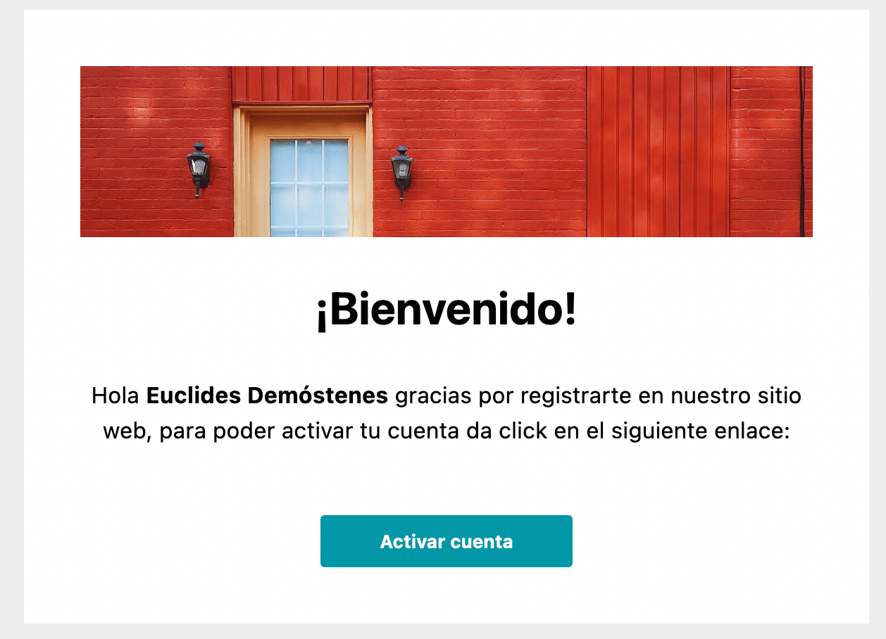

#### Métodos

- **MergeVariables**: Fusionar a un HTML variables
```go
html, err := acornmail.MergeVariables(
    "<div>{{.Title}}</div>",
    acorntypes.AcornVariables{
        "Title": "Hola mundo",
    },
)
if err != nil {
    panic(err)
}

fmt.Println(html)
```

- **NewAcornEmailComponents**: Obtener el tipo **acornEmail** para poder construir un template
```go
acorn := acornmail.NewAcornEmailComponents()
```

#### Componentes

- **GetBoilerplate**
```go
boilerplate := acorn.GetBoilerplate(acorntypes.AcornComponents{
    "Header",
    "Body",
    "Footer",
    // n componentes...
}, nil)
fmt.Println(boilerplate)
```

- **Spacer**
```go
acorn := acornmail.NewAcornEmailComponents()

spacer := acorn.NewSpacer()

boilerplate := acorn.GetBoilerplate(
    acorntypes.AcornComponents{spacer},
    acornstyles.WithoutMargins(),
)

fmt.Println(boilerplate)
```


- **Divider**
```go
acorn := acornmail.NewAcornEmailComponents()

colors := acornstyles.GetColors()

divider := acorn.NewDivider(colors.DeepPurple.M700)

boilerplate := acorn.GetBoilerplate(
    acorntypes.AcornComponents{divider},
    acornstyles.WithoutMargins(),
)

fmt.Println(boilerplate)
```
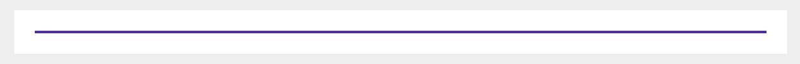

- **Label**
```go
acorn := acornmail.NewAcornEmailComponents()

types := acornstyles.GetTypes()

labelFilled := acorn.NewLabel(&acorntypes.LabelParams{
    Text: "filled label",
})

labelOutlined := acorn.NewLabel(&acorntypes.LabelParams{
    Text: "outlined label",
    Styles: &acorntypes.LabelStyles{
        Type: types.Outlined,
    },
})

boilerplate := acorn.GetBoilerplate(acorntypes.AcornComponents{
    labelFilled,
    labelOutlined,
}, nil)

fmt.Println(boilerplate)
```


- **Image**
```go
acorn := acornmail.NewAcornEmailComponents()

image := acorn.NewImage(&acorntypes.ImageParams{
    Image: "https://i.picsum.photos/id/859/1200/280.jpg?hmac=cFup6pjvVaf67u1WSjrP8LYF8Oty0VrMKI3sbFDz8HQ",
    Alt:   "Logo",
})

boilerplate := acorn.GetBoilerplate(acorntypes.AcornComponents{image}, nil)

fmt.Println(boilerplate)
```

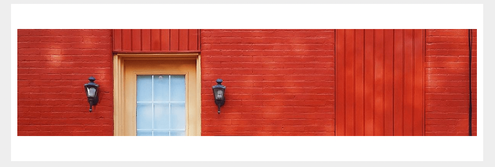

- **Row**
```go
acorn := acornmail.NewAcornEmailComponents()

widthColumns := acornstyles.GetWidthColumns()

row := acorn.NewRow([]*acorntypes.ColumnParams{
    {
        Content: "1/4 de columna",
        Styles: &acorntypes.Styles{
            WidthColumn: widthColumns.Quarter,
        },
    },
    {
        Content: "1/2 de columna",
        Styles: &acorntypes.Styles{
            WidthColumn: widthColumns.Medium,
            Color:     colors.Purple.M700,
            TextColor: colors.White,
        },
    },
    {
        Content: "1/4 de columna",
        Styles: &acorntypes.Styles{
            WidthColumn: widthColumns.Quarter,
        },
    },
})

boilerplate := acorn.GetBoilerplate(acorntypes.AcornComponents{row}, nil)

fmt.Println(boilerplate)
```
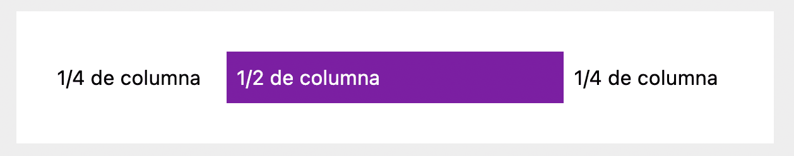

- **Grid**
```go
acorn := acornmail.NewAcornEmailComponents()

widthColumns := acornstyles.GetWidthColumns()
colors := acornstyles.GetColors()

grid := acorn.NewGrid([][]*acorntypes.ColumnParams{
    {
        {
            Content: "100%",
            Styles: &acorntypes.ColumnStyles{
                Width:     widthColumns.Full,
                Color:     colors.Purple.M700,
                TextColor: colors.White,
            },
        },
    },
    nil, // Add spacer
    {
        {
            Content: "1/2 de columna",
            Styles: &acorntypes.ColumnStyles{
                Width: widthColumns.Medium,
            },
        },
        {
            Content: "1/2 de columna",
            Styles: &acorntypes.ColumnStyles{
                Width: widthColumns.Medium,
            },
        },
    },
})

boilerplate := acorn.GetBoilerplate(acorntypes.AcornComponents{grid}, nil)

fmt.Println(boilerplate)
```

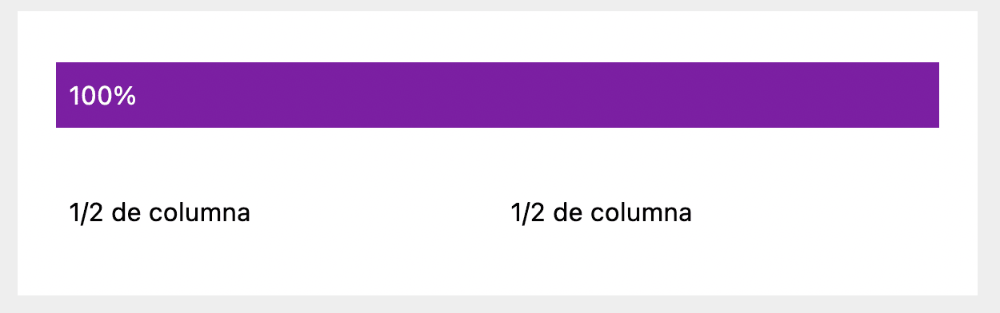

- *Content*
```go

content := acorn.NewContent(&acorntypes.ContentParams{
    Content: row,
    Image:   "https://picsum.photos/1200/800?image=837",
})

// Without image
// content := acorn.NewContent(&acorntypes.ContentParams{
//     Content: row,
// })

boilerplate := acorn.GetBoilerplate(
    acorntypes.AcornComponents{content}, 
    acornstyles.WithoutMargins(),
)

fmt.Println(boilerplate)
```
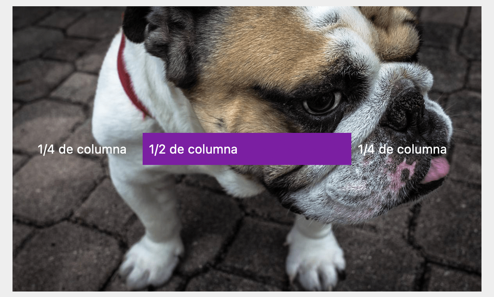
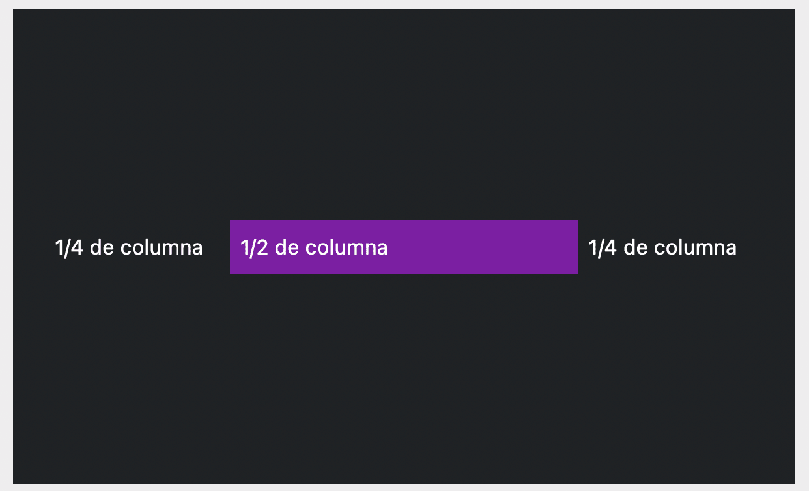

- **Alerts**
```go
acorn := acornmail.NewAcornEmailComponents()

divider := acorn.NewDivider(nil)

alert := acorn.NewAlert(&acorntypes.AlertParams{
    Content: "Alert",
})

alertOutlined := acorn.NewAlert(&acorntypes.AlertParams{
    Content: "Alert",
    Styles: &acorntypes.AlertStyles{
        Outlined: true,
    },
})

boilerplate := acorn.GetBoilerplate(acorntypes.AcornComponents{
    alert,
    divider,
    alertOutlined,
}, nil)

fmt.Println(boilerplate)
```


- **Buttons**
```go
acorn := acornmail.NewAcornEmailComponents()

widthColumns := acornstyles.GetWidthColumns()
types := acornstyles.GetTypes()
aligns := acornstyles.GetAligns()

buttonFilled := acorn.NewButton(&acorntypes.ButtonParams{
    Text: "Filled button",
    Link: "http://docs.thememountain.com/acorn/",
    Styles: &acorntypes.ButtonStyles{
        FullWidth: true,
    },
})

buttonOutlined := acorn.NewButton(&acorntypes.ButtonParams{
    Text: "Outlined button",
    Link: "http://docs.thememountain.com/acorn/",
    Styles: &acorntypes.ButtonStyles{
        Type: types.Outlined,
    },
})

buttonPhill := acorn.NewButton(&acorntypes.ButtonParams{
    Text: "Pill button",
    Link: "http://docs.thememountain.com/acorn/",
    Styles: &acorntypes.ButtonStyles{
        Type:  types.Pill,
        Align: aligns.Center,
    },
})

grid := acorn.NewGrid([][]*acorntypes.ColumnParams{
    {
        {
            Content: buttonFilled,
            Styles: &acorntypes.ColumnStyles{
                Width: widthColumns.Full,
            },
        },
    },
    nil, // Add spacer
    {
       {
            Content: buttonOutlined,
            Styles: &acorntypes.ColumnStyles{
                Width: widthColumns.Medium,
            },
        },
        {
            Content: buttonPhill,
            Styles: &acorntypes.ColumnStyles{
                Width: widthColumns.Medium,
            },
        },
    },
})

boilerplate := acorn.GetBoilerplate(acorntypes.AcornComponents{grid}, nil)

fmt.Println(boilerplate)
```


- **Accordion**
```go
acorn := acornmail.NewAcornEmailComponents()

colors := acornstyles.GetColors()

accordion := acorn.NewAccordion([]*acorntypes.AccordionParams{
    {
        Title:   "Panel 1",
        Content: "Lorem ipsum dolor sit amet, consectetur adipisicing elit.",
    },
    {
        Title:   "Panel 2",
        Content: "Lorem ipsum dolor sit amet, consectetur adipisicing elit.",
        Styles: &acorntypes.AccordionStyles{
            Color:        colors.Cyan.M300,
            TitleColor:   colors.White,
            ContentColor: colors.Cyan.M300,
        },
    },
})

boilerplate := acorn.GetBoilerplate(acorntypes.AcornComponents{accordion}, nil)

fmt.Println(boilerplate)
```
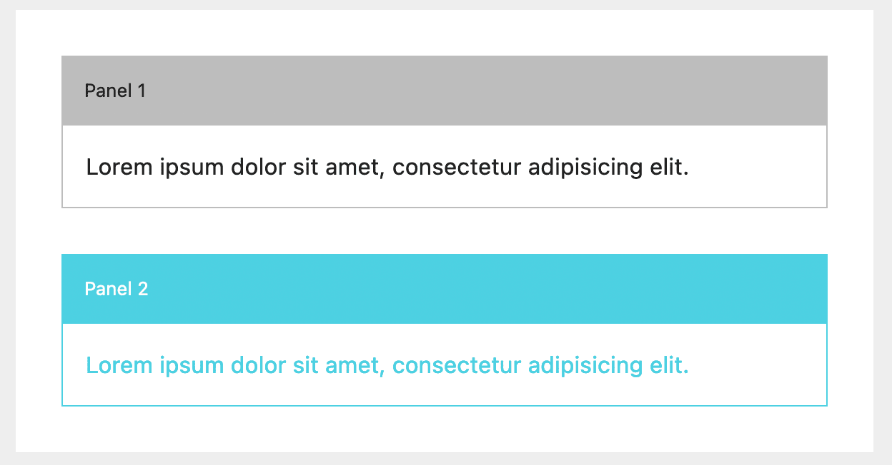

- **Timeline**
```go
acorn := acornmail.NewAcornEmailComponents()

//== Limitaciones ==//
// Time: Max 11 caracteres
// Title: Max 37 caracteres
// Content: Max 78 caracteres

timeline := acorn.NewTimeline([]*acorntypes.TimelineParams{
    {
        Time:    "2007 - 2008",
        Title:   "Massachusetts Institute of Technology",
        Content: "Co-wrote a book on the Semantic Web and Best Practices for Developers.",
    },
    {
        Time:    "2004 - 2006",
        Title:   "Parsons School of Design",
        Content: "Awarded Best Designer of the Year voted by student and teacher body.",
    },
    {
        Time:    "2002 - 2004",
        Title:   "Berkley College",
        Content: "Two year program with a focus on design principles and Javascript development.",
    },
})

boilerplate := acorn.GetBoilerplate(acorntypes.AcornComponents{timeline}, nil)

fmt.Println(boilerplate)
```


- **Testimonial**
```go
acorn := acornmail.NewAcornEmailComponents()

aligns := acornstyles.GetAligns()
colors := acornstyles.GetColors()

testimonialBorder := acorn.NewTestimonial(&acorntypes.TestimonialParams{
    Testimonial: "Sometimes when you innovate, you make mistakes. It is best to admit them quickly, and get on with improving your other innovations.",
    Author:      "Steve Jobs",
    Styles: &acorntypes.TestimonialStyles{
        BorderColor: colors.Orange.M500,
    },
})

testimonialIcon := acorn.NewTestimonial(&acorntypes.TestimonialParams{
    Testimonial: "Sometimes when you innovate, you make mistakes. It is best to admit them quickly, and get on with improving your other innovations.",
    Author:      "Steve Jobs",
    Icon:        true,
})

testimonialImage := acorn.NewTestimonial(&acorntypes.TestimonialParams{
    Testimonial: "Sometimes when you innovate, you make mistakes. It is best to admit them quickly, and get on with improving your other innovations.",
    Author:      "Steve Jobs",
    Styles: &acorntypes.TestimonialStyles{
        Image: "https://gravatar.com/avatar/5ad269974f4c69c9ff6eca2ad2d1d0b8?s=400&d=robohash&r=x",
        Align: aligns.Center,
    },
})

boilerplate := acorn.GetBoilerplate(acorntypes.AcornComponents{
    testimonialBorder,
    testimonialIcon,
    testimonialImage,
}, nil)

fmt.Println(boilerplate)
```
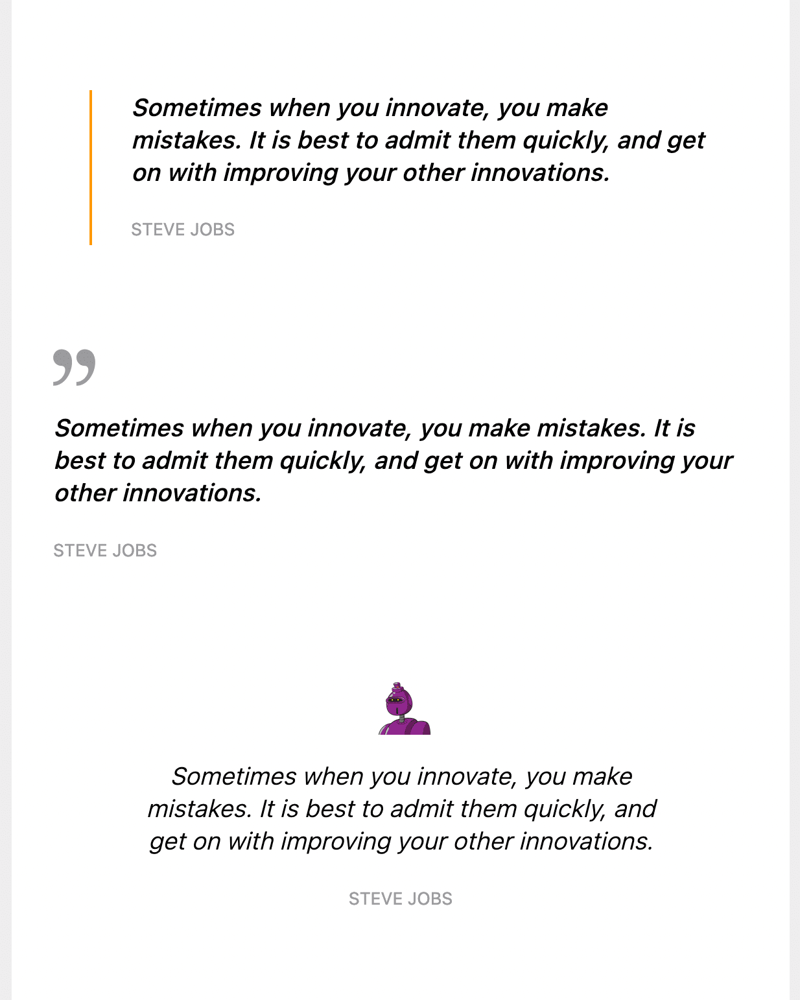

#### Tipos

- *Importación*
```go
import "github.com/arskang/gomail-acorn-template/acorntypes"
```

- *Básicos*

    - Align ```acorntypes.Align```
    - Color ```acorntypes.Color```
    - WidthColumn ```acorntypes.WidthColumn```
    - Types ```acorntypes.Types```
    - AcornComponents ```acorntypes.AcornComponents```
    - AcornVariables ```acorntypes.AcornVariables```

- *Compuestos*

    - ColumnParams ```acorntypes.ColumnParams```
    - ColumnStyles ```acorntypes.ColumnStyles```
    - ButtonParams ```acorntypes.ButtonParams```
    - ButtonStyles ```acorntypes.ButtonStyles```
    - AlertParams ```acorntypes.AlertParams```
    - AlertStyles ```acorntypes.AlertStyles```
    - AccordionParams ```acorntypes.AccordionParams```
    - AccordionStyles ```acorntypes.AccordionStyles```
    - LabelParams ```acorntypes.LabelParams```
    - LabelStyles ```acorntypes.LabelStyles```
    - ContentParams ```acorntypes.ContentParams```
    - TimelineParams ```acorntypes.TimelineParams```
    - TestimonialParams ```acorntypes.TestimonialParams```
    - TestimonialStyles ```acorntypes.TestimonialStyles```
    - ImageParams ```acorntypes.ImageParams```

#### Estilos

- *Importación*
```go
import "github.com/arskang/gomail-acorn-template/acornstyles"
```

- *Tipo de botones*

```go
types := acornstyles.GetTypes()
fmt.Println(types.Filled)
fmt.Println(types.Outlined)
fmt.Println(types.Pill)
```

- *Alineaciones*

```go
aligns := acornstyles.GetAligns()
fmt.Println(aligns.Center)
fmt.Println(aligns.Right)
fmt.Println(aligns.Left)
```

- *Ancho de columnas*

```go
widthColumn := acornstyles.GetWidthColumns()
fmt.Println(widthColumn.Full) // 100%
fmt.Println(widthColumn.Quarter) // 1/4
fmt.Println(widthColumn.Medium) // 1/2
fmt.Println(widthColumn.ThreeQuarters) // 3/4
fmt.Println(widthColumn.OneThird) // 1/3
fmt.Println(widthColumn.TwoThird) // 2/3
```

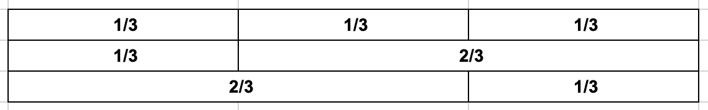
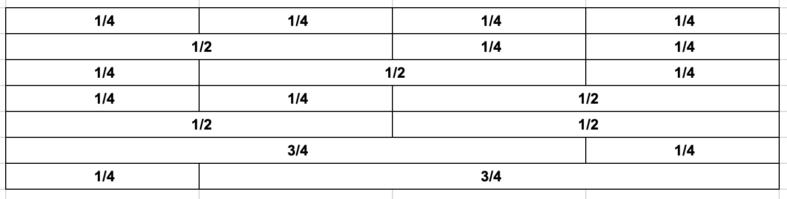

- *Colores*

```go
colors := acornstyles.GetColors()
red50 := colors.Red.M50
fmt.Println(red50)

// Only hexadecimal string
customColor, err := acornstyles.NewAcornColor("#fea800")
if err != nil {
    panic(err)
}
fmt.Println(customColor)
```


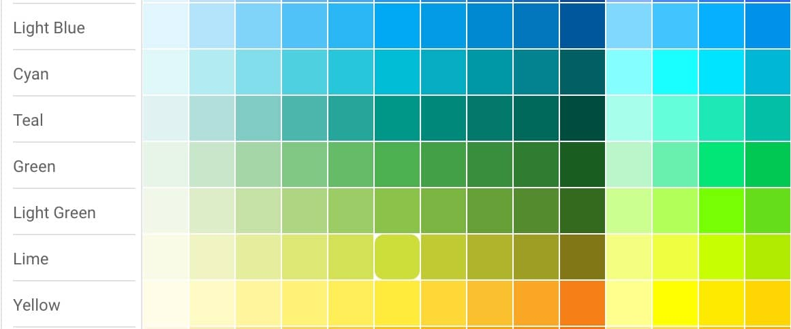
