# Gomail Acorn Template

+ [Librerías](#librerías)
+ [Instalación](#instalación)
+ [Importación](#importación)
+ [Ejemplo](#ejemplo)
+ [Métodos](#métodos)
+ [Componentes](#componentes)
+ [Tipos](#tipos)
+ [Estilos](#estilos)

#### Librerías
Proyecto original:
- [Acorn Email Framework](http://docs.thememountain.com/acorn/)

Colores:
- [Material design](https://material.io/resources/color/#!/?view.left=0&view.right=0)

#### Instalación
```
go get -u github.com/arskang/gomail-acorn-template
```

#### Importación
```go
import acornmail "github.com/arskang/gomail-acorn-template"
```

#### Ejemplo
```go
import acornmail "github.com/arskang/gomail-acorn-template"

func main() {

    acorn := acornmail.NewAcornEmailComponents()

}

```

#### Métodos

- *MergeVariables*: Fusionar a un HTML variables
```go
html, err := acornmail.MergeVariables(
    "<div>{{.Title}}</div>",
    acorntypes.AcornVariables{
        "Title": "Hola mundo",
    },
)
if err != nil {
    panic(err)
}

fmt.Println(html)
```

- *NewAcornEmailComponents*: Obtener el tipo **acornEmail** para poder construir un template
```go
acorn := acornmail.NewAcornEmailComponents()
```

##### Componentes

- **GetBoilerplate**
```go
boilerplate := acorn.GetBoilerplate(acorntypes.AcornComponents{
    "Header",
    "Body",
    "Footer",
    // n componentes...
}, nil)
fmt.Println(boilerplate)
```

- **Spacer**
```go
spacer := acorn.NewSpacer()
fmt.Println(spacer)
```

- **Divider**
```go
divider := acorn.NewDivider()
fmt.Println(divider)
```

- **Label**
```go
acorn := acornmail.NewAcornEmailComponents()

types := acornstyles.GetTypes()

labelFilled := acorn.NewLabel(&acorntypes.LabelParams{
    Text: "filled label",
})

labelOutlined := acorn.NewLabel(&acorntypes.LabelParams{
    Text: "outlined label",
    Styles: &acorntypes.LabelStyles{
        Type: types.Outlined,
    },
})

boilerplate := acorn.GetBoilerplate(acorntypes.AcornComponents{
    labelFilled,
    labelOutlined,
}, nil)

fmt.Println(boilerplate)
```
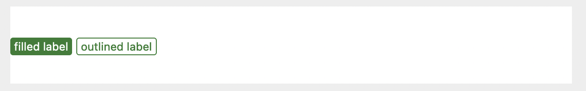

- **Grid**
```go
acorn := acornmail.NewAcornEmailComponents()

widthColumns := acornstyles.GetWidthColumns()

row := acorn.NewRow([]*acorntypes.ColumnParams{
    {
        Content: "1/4 de columna",
        Styles: &acorntypes.Styles{
            WidthColumn: widthColumns.Quarter,
        },
    },
    {
        Content: "1/2 de columna",
        Styles: &acorntypes.Styles{
            WidthColumn: widthColumns.Medium,
            Color:     colors.Purple.M700,
            TextColor: colors.White,
        },
    },
    {
        Content: "1/4 de columna",
        Styles: &acorntypes.Styles{
            WidthColumn: widthColumns.Quarter,
        },
    },
})

boilerplate := acorn.GetBoilerplate(acorntypes.AcornComponents{row}, nil)

fmt.Println(boilerplate)
```
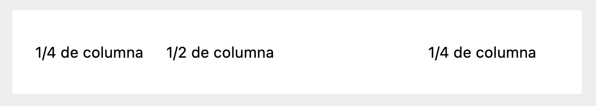

- *Content*
```go

content := acorn.NewContent(&acorntypes.ContentParams{
    Content: row,
    Image:   "https://picsum.photos/1200/800?image=837",
})

// Without image
// content := acorn.NewContent(&acorntypes.ContentParams{
//     Content: row,
// })

withoutMargins := true
boilerplate := acorn.GetBoilerplate(acorntypes.AcornComponents{content}, &withoutMargins)

fmt.Println(boilerplate)
```

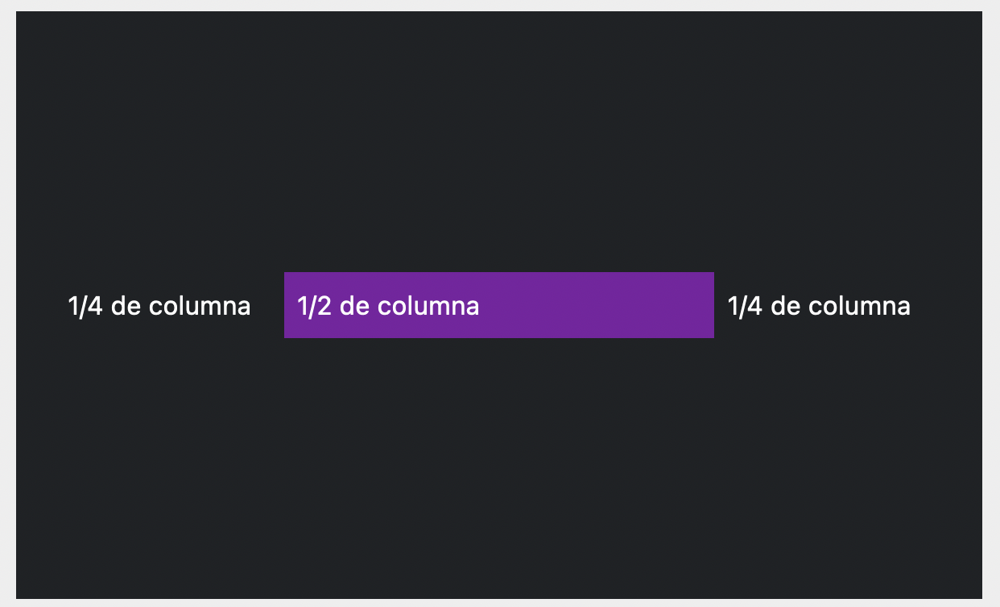

- **Alerts**
```go
acorn := acornmail.NewAcornEmailComponents()

divider := acorn.NewDivider(nil)

alert := acorn.NewAlert(&acorntypes.AlertParams{
    Content: "Alert",
})

alertOutlined := acorn.NewAlert(&acorntypes.AlertParams{
    Content: "Alert",
    Styles: &acorntypes.AlertStyles{
        Outlined: true,
    },
})

boilerplate := acorn.GetBoilerplate(acorntypes.AcornComponents{
    alert,
    divider,
    alertOutlined,
}, nil)

fmt.Println(boilerplate)
```
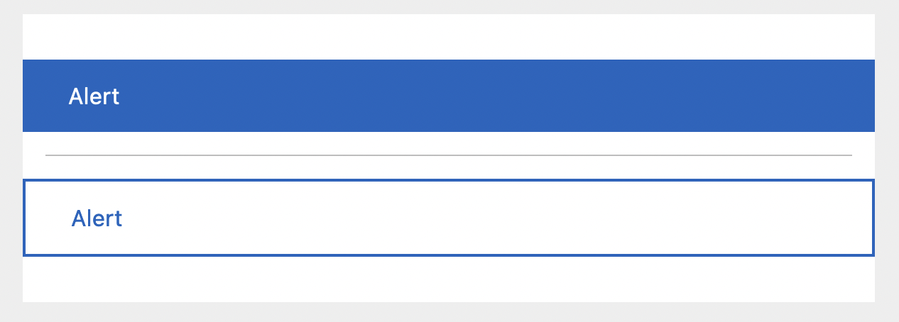

- **Buttons**
```go
acorn := acornmail.NewAcornEmailComponents()

widthColumns := acornstyles.GetWidthColumns()
types := acornstyles.GetTypes()
aligns := acornstyles.GetAligns()

divider := acorn.NewDivider(nil)

buttonFilled := acorn.NewButton(&acorntypes.ButtonParams{
    Text: "Filled button",
    Link: "http://docs.thememountain.com/acorn/",
    Styles: &acorntypes.ButtonStyles{
        FullWidth: true,
    },
})

buttonOutlined := acorn.NewButton(&acorntypes.ButtonParams{
    Text: "Outlined button",
    Link: "http://docs.thememountain.com/acorn/",
    Styles: &acorntypes.ButtonStyles{
        Type: types.Outlined,
    },
})

buttonPhill := acorn.NewButton(&acorntypes.ButtonParams{
    Text: "Pill button",
    Link: "http://docs.thememountain.com/acorn/",
    Styles: &acorntypes.ButtonStyles{
        Type:  types.Pill,
        Align: aligns.Center,
    },
})

rowOne := acorn.NewRow([]*acorntypes.ColumnParams{
    {
        Content: buttonFilled,
        Styles: &acorntypes.ColumnStyles{
            Width: widthColumns.Full,
        },
    },
})

rowTwo := acorn.NewRow([]*acorntypes.ColumnParams{
    {
        Content: buttonOutlined,
        Styles: &acorntypes.ColumnStyles{
            Width: widthColumns.Medium,
        },
    },
    {
        Content: buttonPhill,
        Styles: &acorntypes.ColumnStyles{
            Width: widthColumns.Medium,
        },
    },
})

boilerplate := acorn.GetBoilerplate(acorntypes.AcornComponents{
    rowOne,
    divider,
    rowTwo,
}, nil)

fmt.Println(boilerplate)
```
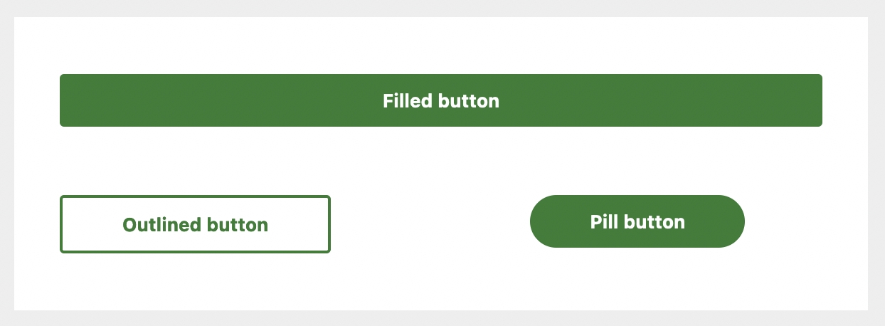

- **Accordion**
```go
acorn := acornmail.NewAcornEmailComponents()

colors := acornstyles.GetColors()

accordion := acorn.NewAccordion([]*acorntypes.AccordionParams{
    {
        Title:   "Panel 1",
        Content: "Lorem ipsum dolor sit amet, consectetur adipisicing elit.",
    },
    {
        Title:   "Panel 2",
        Content: "Lorem ipsum dolor sit amet, consectetur adipisicing elit.",
        Styles: &acorntypes.AccordionStyles{
            Color:        colors.Cyan.M300,
            TitleColor:   colors.White,
            ContentColor: colors.Cyan.M300,
        },
    },
})

boilerplate := acorn.GetBoilerplate(acorntypes.AcornComponents{accordion}, nil)

fmt.Println(boilerplate)
```
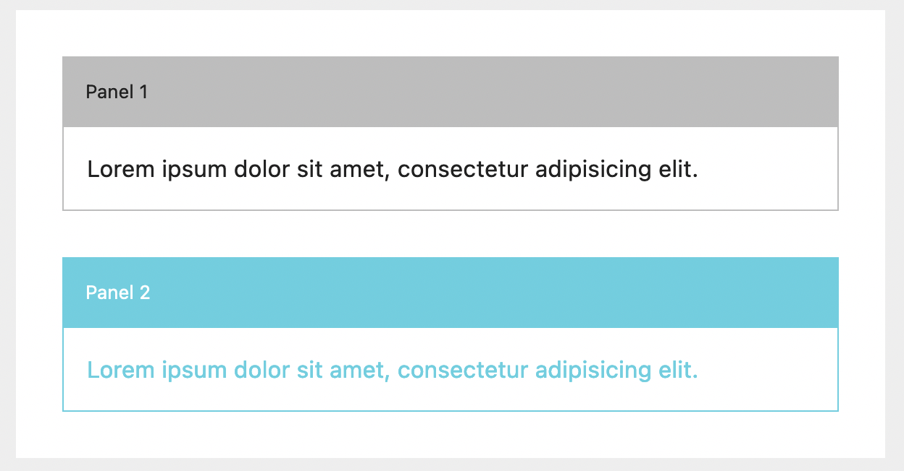

- **Timeline**
```go
acorn := acornmail.NewAcornEmailComponents()

// Time: Max 11 caracteres
// Title: Max 37 caracteres
// Content: Max 78 caracteres

timeline := acorn.NewTimeline([]*acorntypes.TimelineParams{
    {
        Time:    "2007 - 2008",
        Title:   "Massachusetts Institute of Technology",
        Content: "Co-wrote a book on the Semantic Web and Best Practices for Developers.",
    },
    {
        Time:    "2004 - 2006",
        Title:   "Parsons School of Design",
        Content: "Awarded Best Designer of the Year voted by student and teacher body.",
    },
    {
        Time:    "2002 - 2004",
        Title:   "Berkley College",
        Content: "Two year program with a focus on design principles and Javascript development.",
    },
})

boilerplate := acorn.GetBoilerplate(acorntypes.AcornComponents{timeline}, nil)

fmt.Println(boilerplate)
```
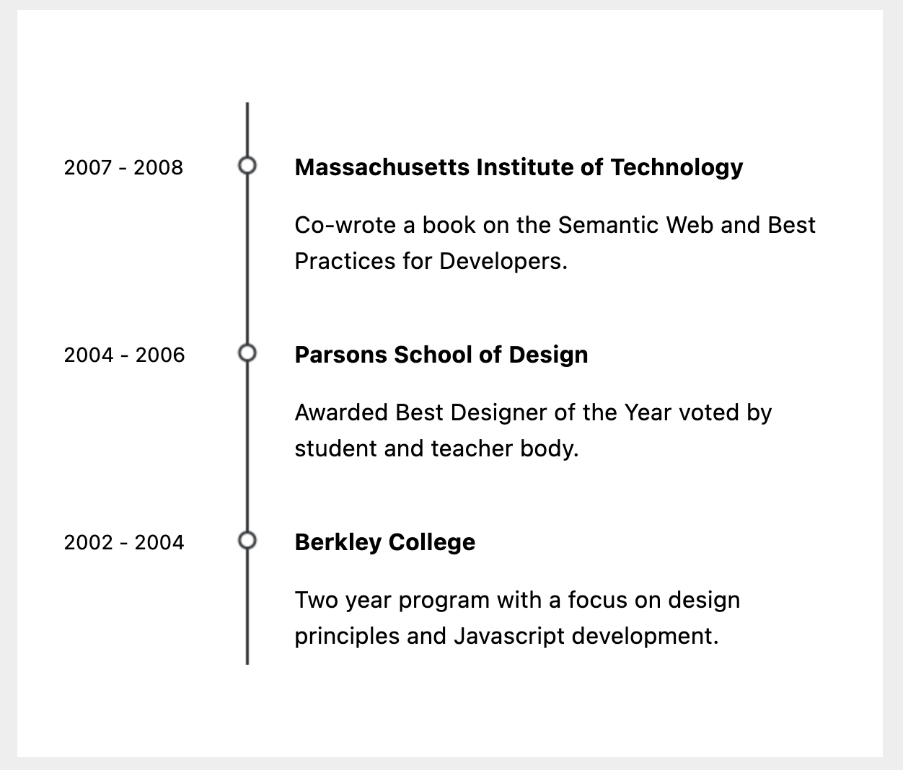

#### Tipos

- *Importación*
```go
import "github.com/arskang/gomail-acorn-template/acorntypes"
```

- *Básicos*

    - Align ```acorntypes.Align```
    - Color ```acorntypes.Color```
    - WidthColumn ```acorntypes.WidthColumn```
    - Types ```acorntypes.Types```
    - AcornComponents ```acorntypes.AcornComponents```
    - AcornVariables ```acorntypes.AcornVariables```

- *Compuestos*

    - ColumnParams ```acorntypes.ColumnParams```
    - ColumnStyles ```acorntypes.ColumnStyles```
    - ButtonParams ```acorntypes.ButtonParams```
    - ButtonStyles ```acorntypes.ButtonStyles```
    - AlertParams ```acorntypes.AlertParams```
    - AlertStyles ```acorntypes.AlertStyles```
    - AccordionParams ```acorntypes.AccordionParams```
    - AccordionStyles ```acorntypes.AccordionStyles```
    - LabelParams ```acorntypes.LabelParams```
    - LabelStyles ```acorntypes.LabelStyles```
    - ContentParams ```acorntypes.ContentParams```
    - TimelineParams ```acorntypes.TimelineParams```

#### Estilos

- *Importación*
```go
import "github.com/arskang/gomail-acorn-template/acornstyles"
```

- *Tipo de botones*

```go
types := acornstyles.GetTypes()
fmt.Println(types.Filled)
fmt.Println(types.Outlined)
fmt.Println(types.Pill)
```

- *Alineaciones*

```go
aligns := acornstyles.GetAligns()
fmt.Println(aligns.Center)
fmt.Println(aligns.Right)
fmt.Println(aligns.Left)
```

- *Ancho de columnas*

```go
widthColumn := acornstyles.GetWidthColumns()
fmt.Println(widthColumn.Full) // 100%
fmt.Println(widthColumn.Quarter) // 1/4
fmt.Println(widthColumn.Medium) // 1/2
fmt.Println(widthColumn.ThreeQuarters) // 3/4
fmt.Println(widthColumn.OneThird) // 1/3
fmt.Println(widthColumn.TwoThird) // 2/3
```

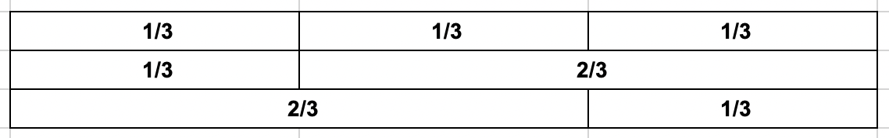


- *Colores*

```go
colors := acornstyles.GetColors()
red50 := colors.Red.M50
fmt.Println(red50)

// Only hexadecimal string
customColor, err := acornstyles.NewAcornColor("#fea800")
if err != nil {
    panic(err)
}
fmt.Println(customColor)
```

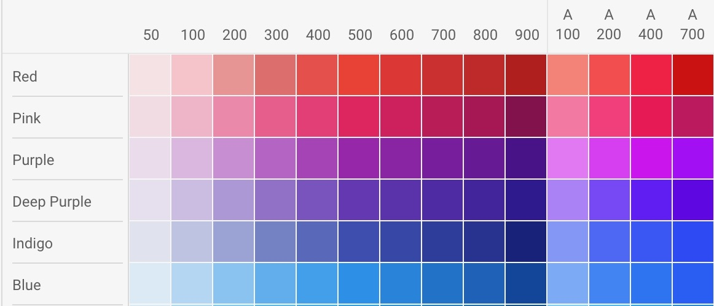
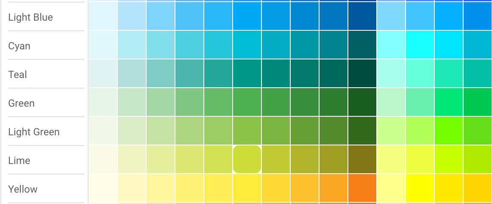
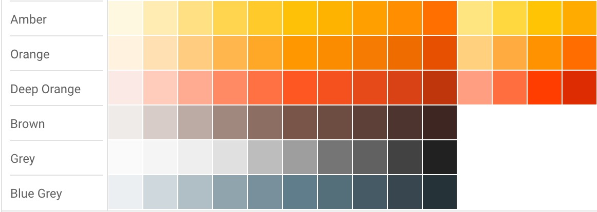